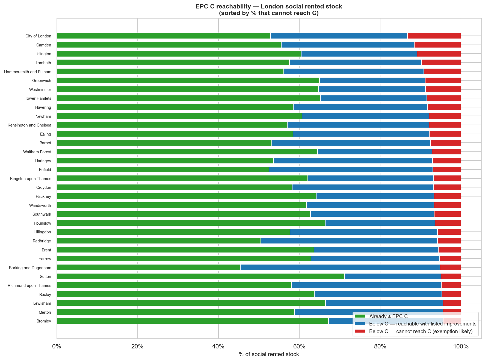
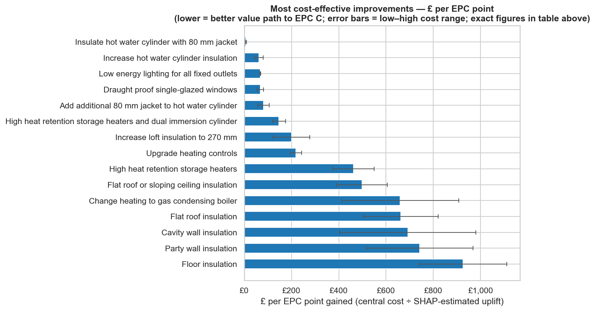
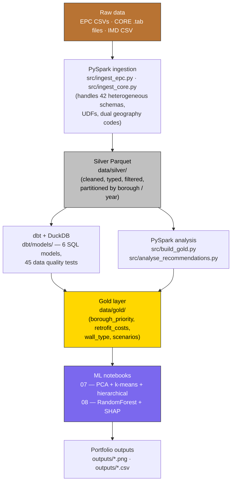

# London Social Housing Pipeline

[](https://github.com/llani-rainey/london-social-housing-retrofit-pipeline/actions/workflows/ci.yml)
[](LICENSE)


## Contents

- [Skills demonstrated](#skills-demonstrated)
- [How to explore this repo](#how-to-explore-this-repo)
- [Results](#results)
- [Policy context](#policy-context)
- [Data sources](#data-sources)
- [Notebook structure](#notebook-structure)
- [Architecture](#architecture)
- [Key engineering decisions](#key-engineering-decisions)
- [Exploratory findings](#exploratory-findings)
- [Limitations](#limitations)
- [Tech stack](#tech-stack)
- [Setup](#setup)

Nearly **200,000 households in London's social rented sector live in homes below EPC C** — a technical label that translates to higher energy bills, colder rooms, and worse health outcomes for tenants who are already disproportionately low-income, elderly, disabled, or otherwise vulnerable. The **Warm Homes: Social Housing Fund Wave 3 (£1.29bn, 2025–2028)** was allocated in March 2025 to help address this by the April 2030 target, and Labour has committed a further **£13.2bn** for housing retrofit through 2030 — meaning successive funding rounds and delivery decisions will keep landing over the next several years. Whether an association is a Wave 3 winner sequencing spend to Sept 2028, a bidder into a future round, or a landlord reporting statutory progress to the Regulator of Social Housing, the same underlying question has to be answered: **which of my stock is worst, and whose tenants would benefit most?** This pipeline produces exactly that evidence — not just to help associations win funding, but to help them target it toward the tenants who most need protection from fuel poverty, cold-home illness, and the £10k retrofit exemption cap that risks stranding the poorest boroughs. Getting the prioritisation right also delivers material carbon co-benefits: the highest-need boroughs also have the highest CO₂ intensity in their social stock, so retrofit and net zero pull in the same direction here.

It ingests three public datasets — EPC certificates, CORE social lettings microdata, and the Index of Multiple Deprivation — cleans and joins them using a **Bronze → Silver → Gold medallion architecture** in PySpark, transforms them with **dbt + DuckDB**, and answers four questions that together give a housing association a complete evidence base for retrofit planning:

1. **Which boroughs have the worst social housing stock AND the most financially vulnerable tenants?** — composite borough priority ranking for the £1.29bn Wave 3 fund (in delivery to Sept 2028) and future rounds under the £13.2bn Labour retrofit pledge (`nb05`).
2. **Which retrofit measures deliver the most EPC points per pound spent?** — a novel £/EPC-point cost-effectiveness ranking derived from **RandomForest + SHAP attribution** on 491k unique properties (`nb08`). Hot water cylinder insulation is the standout quick-win at ~£7 per EPC point — ~9× more cost-effective than the next best measure.
3. **How many properties will need the £10k retrofit exemption cap, and where are they concentrated?** — assessor-based reachability + borough-level cost exposure (`nb08`). ~36k properties are structurally unreachable to C; a further ~27k reach C but cost over £10k.
4. **Are the priority rankings statistically robust?** — **PCA + k-means + hierarchical clustering** as a cross-method robustness check (`nb07`). The top-priority boroughs are stable across every method, which strengthens the case for the composite ranking.

Outputs are directly usable — a housing association could plug the CSVs and Parquet files straight into Wave 3 delivery planning, a future funding-round bid, or statutory reporting to the Regulator of Social Housing without further modelling. The project was built to demonstrate a production-style data engineering workflow: multi-source ingestion with schema handling, medallion layering, joined analysis, and ML-based cost-effectiveness attribution — all grounded in live government policy rather than a synthetic dataset.



*The retrofit challenge, sorted: for each London borough, the share of social rented stock already at EPC C, reachable to C with assessor-listed improvements, and structurally unreachable (exemption candidates). Underlying analysis: `notebooks/08_minimum_cost_to_c.ipynb`.*

---

## Skills demonstrated

- **PySpark** — ingesting 23M-row EPC dataset and 42 heterogeneous CORE `.tab` files (7 schema variants over 15 years) into partitioned Silver Parquet
- **Medallion architecture** — Bronze / Silver / Gold layering with `data/` folder discipline and `partitionBy` strategies chosen per dataset
- **dbt + DuckDB** — 6 SQL models on top of Silver Parquet with 45 data quality tests
- **Schema handling** — dual geography codes (`'7'` vs `'E12000007'`), tenure-label variants, banded string parsing to numeric via UDFs
- **Real-world data quality** — surfaced and fixed a 1.28× certificate-per-property duplication in EPC data via UPRN dedup with postcode+address1 fallback and latest-inspection-date rule; without it, downstream counts are inflated ~28%
- **Feature engineering** — RandomForest + SHAP attribution for per-recommendation cost-effectiveness ranking, stratified by construction age band
- **Unsupervised ML** — PCA + k-means + hierarchical clustering with cross-method validation for defensible borough prioritisation
- **Testing** — 18 pytest unit tests on pure helpers, 45 dbt data-quality assertions, integration tests skipping cleanly when notebooks haven't run
- **CI** — GitHub Actions running lint (ruff), syntax check, unit tests, and dbt parse on every push
- **Reproducibility** — pinned dependencies, Makefile targets, notebook + src/ parity for critical transformations, prefect flow for optional orchestration
- **Policy grounding** — analysis tied to the £1.29bn Warm Homes Fund Wave 3 (delivery to Sept 2028), the £13.2bn pipeline of future rounds, the April 2030 EPC C target, and the £10k retrofit exemption cap; findings interpretable to a housing-association, GLA, or Combined Authority audience

---

## How to explore this repo

Depending on what you want to see, jump in at:

- **The composite borough ranking** (production-style medallion pipeline): start with `notebooks/05_build_gold.ipynb` or run `make all`.
- **The ML retrofit-cost analysis** (RandomForest + SHAP): `notebooks/08_minimum_cost_to_c.ipynb` — the most technically involved notebook.
- **The clustering robustness check** (PCA + k-means + hierarchical): `notebooks/07_clustering_analysis.ipynb` — includes the "deprivation + retrofit cost" PC1 finding.
- **The recommendation deep-dive** (cost breakdown, cavity vs solid wall): `notebooks/06_recommendations_analysis.ipynb`.
- **The raw data engineering** (schema handling, geography codes, tenure variants): `notebooks/01_explore_epc.ipynb` → `02_explore_core.ipynb` → `03_ingest_epc.ipynb` → `04_ingest_core.ipynb`.
- **Production Python parity** (same transformations, non-notebook): `src/*.py`, invocable via `make ingest`.
- **SQL transformation layer**: `dbt/models/` — 6 models with 45 data quality tests, runnable via `make dbt`.

---

## Results

| Priority Rank | Borough | % Social Stock Below EPC C | Income Deprivation Rate | % Pre-1950 Stock |
|---|---|---|---|---|
| 1 | Barking and Dagenham | 54.6% | 19.4% | 44.1% |
| 2 | Haringey | 46.4% | 16.8% | 47.5% |
| 3 | Hammersmith and Fulham | 43.8% | 14.2% | 57.7% |
| 4 | Lambeth | 42.4% | 15.6% | 46.7% |
| 5 | Enfield | 47.5% | 16.8% | 32.5% |
| 6 | Kensington and Chelsea | 43.0% | 12.1% | 55.1% |
| 6 | Camden | 44.4% | 14.0% | 41.9% |
| 7 | Hackney | 35.8% | 19.9% | 43.3% |

Boroughs are ranked by a composite score averaging three equal-weight dimensions: % of social stock below EPC C (housing quality), IMD 2019 income deprivation rate (financial vulnerability), and % of stock built before 1950 (retrofit difficulty). Rank 1 = highest need for retrofit investment.

*Numbers reflect one certificate per property — the pipeline deduplicates raw EPC data (~1.28× multiple assessments per property) via UPRN, keeping the latest inspection date. See `notebooks/03_ingest_epc.ipynb` §3 for the dedup rationale.*

**London-wide affordability context (CORE data, 2020–2022):** 60%+ of London social housing tenants spend more than half their income on rent.

**Notable finding:** Kensington & Chelsea appears in the top 10 despite being an affluent borough. It has the highest proportion of pre-1950 social stock in the dataset (57%), and its deprived wards — including the area around Grenfell Tower — have income deprivation rates comparable to East London. Borough-level wealth does not protect social tenants from poor housing conditions.

### Beyond the composite ranking

Two ML notebooks refine the picture further:

**Notebook 07 — clustering as a robustness check.** The composite ranking uses `% pre-1950` as a retrofit-cost proxy. PCA on a revised feature set (replacing pre-1950 with `% solid wall recommendations` — a direct cost signal from assessor data) revealed something more interesting than the suspected EPC-and-age double-count: **the dominant variance axis in London social housing is `income deprivation + retrofit cost`, not `EPC quality + age`.** The boroughs where residents most need cost-of-living relief are the same boroughs where each home is physically the most expensive to retrofit. That has direct policy implications: a flat £/home retrofit budget will under-serve the neediest boroughs, and the £10k exemption cap will bite hardest exactly where need is greatest.

**Notebook 08 — cost-effectiveness ranking.** A RandomForest trained on 612,357 EPC certificates plus SHAP attribution ranks each retrofit measure by £-per-EPC-point:

| Measure | Est. EPC uplift | Central cost | £ per EPC point |
|---|---|---|---|
| Insulate hot water cylinder (80mm jacket) | 3.5 pts | £23 | **£7** |
| Increase hot water cylinder insulation | 0.4 pts | £24 | £62 |
| Draught-proof single-glazed windows | 1.7 pts | £118 | £68 |
| Low-energy lighting (all outlets) | 0.4 pts | £29 | £68 |
| Cavity wall insulation | ~1.5 pts | £1,053 | ~£700 |
| Solid wall insulation | ~1.5 pts | £8,000–£25,000 | ~£8,000 |

**Cylinder insulation is ~9× more cost-effective than the next best measure** — a genuinely striking finding that validates the model against building physics literature and gives housing associations a concrete quick-win to prioritise before committing to major fabric works.



> **⚠ Interpretation caveat for the fabric measures (cavity wall, solid wall).** The SHAP figures underestimate the standalone physical uplift of these measures for two reasons:
>
> 1. **Multicollinearity with construction age.** Solid-wall recommendations correlate ~95% with pre-1919 stock, so the model's `construction_age_band` feature absorbs a large share of the attribution that would "physically" belong to the SWI feature. This is a well-known SHAP behaviour with correlated features.
> 2. **Flat vs house archetype.** London social rented stock is ~60% flats. A mid-floor flat with party walls on 2+ sides has far less exposed external wall area than a detached house, so genuine physical uplift from SWI on a flat is 2–4 SAP pts, not the 8–25 pts often cited from house-weighted industry benchmarks.
>
> Practical takeaway: the **ranking of quick-wins (cylinder → draught-proofing → lighting) is reliable**; the absolute numbers for structural measures should be checked against RdSAP output for a housing association's specific archetype mix, not compared to generic web tables.

**Retrofit stock in numbers (post-dedup):**
- **491,869** unique London social rented properties
- **195,204** below EPC C (**39.7%** — the headline figure)
- **159,202** assessor-reachable to C by 2030 (81.6% of below-C)
- **36,002** structurally unreachable (exemption candidates — 18.4%)
- Median gap to C: **6 EPC points** (mean 8.4)

### Borough retrofit summary — all 33 London boroughs

Full borough-level breakdown of below-C stock, EPC C reachability, retrofit cost exposure, and £10k cap exposure across all 33 London boroughs. Sorted by median cost to C (descending) — highest-exposure boroughs at the top.

| Borough | Below C | % reachable | Avg recs to C | Median cost to C (mid, low–high) | % over £10k cap | Avg EPC gap |
|---|---:|---:|---:|---|---:|---:|
| Westminster | 5,555 | 75.3% | 2.3 | £9,000 (£4,000–£11,250) | 13.3% | 9.2 |
| Hackney | 8,166 | 81.3% | 2.6 | £9,000 (£4,020–£11,000) | 16.2% | 7.8 |
| Wandsworth | 6,805 | 82.5% | 2.6 | £9,000 (£4,800–£10,515) | 17.6% | 8.6 |
| Brent | 4,773 | 84.7% | 2.7 | £9,000 (£4,800–£10,000) | 18.4% | 9.6 |
| Camden | 7,741 | 74.1% | 2.5 | £9,000 (£4,020–£12,570) | 12.1% | 8.9 |
| Lambeth | 14,101 | 77.0% | 2.4 | £9,000 (£4,020–£11,000) | 12.9% | 8.7 |
| Kensington and Chelsea | 4,820 | 81.6% | 2.4 | £9,000 (£4,000–£11,212) | 11.3% | 8.8 |
| Hammersmith and Fulham | 7,703 | 79.2% | 2.5 | £9,000 (£4,040–£11,200) | 16.6% | 8.1 |
| Islington | 8,845 | 72.5% | 2.4 | £8,020 (£4,010–£9,860) | 13.0% | 8.3 |
| Lewisham | 9,159 | 86.8% | 2.4 | £8,000 (£4,100–£10,000) | 15.9% | 7.2 |
| Barking and Dagenham | 7,095 | 90.5% | 3.2 | £7,220 (£5,340–£8,558) | 24.0% | 8.4 |
| Haringey | 7,789 | 84.9% | 2.8 | £7,215 (£4,810–£8,625) | 18.9% | 8.4 |
| Harrow | 2,611 | 85.9% | 2.7 | £7,188 (£4,908–£7,975) | 20.0% | 8.7 |
| Hillingdon | 5,427 | 86.3% | 2.7 | £7,000 (£5,500–£8,200) | 22.3% | 8.3 |
| Ealing | 5,912 | 81.2% | 2.9 | £6,925 (£4,800–£7,650) | 16.0% | 8.6 |
| Newham | 8,274 | 79.9% | 2.9 | £6,675 (£4,850–£7,572) | 22.5% | 7.7 |
| Redbridge | 3,750 | 88.3% | 3.1 | £6,675 (£4,800–£7,710) | 18.9% | 8.6 |
| Southwark | 7,063 | 82.3% | 2.8 | £6,672 (£4,025–£8,070) | 14.6% | 9.0 |
| Croydon | 7,348 | 83.8% | 2.9 | £6,500 (£4,800–£7,595) | 18.6% | 9.1 |
| Enfield | 8,516 | 85.5% | 3.0 | £6,500 (£4,820–£7,738) | 19.9% | 9.7 |
| Havering | 3,809 | 80.3% | 3.0 | £6,398 (£4,825–£7,520) | 20.3% | 7.8 |
| Hounslow | 4,042 | 80.9% | 2.9 | £6,315 (£4,800–£7,550) | 17.2% | 7.8 |
| Sutton | 2,988 | 83.0% | 2.5 | £6,175 (£4,500–£7,530) | 15.9% | 7.8 |
| Merton | 3,090 | 89.3% | 2.9 | £6,175 (£4,800–£7,450) | 16.7% | 8.1 |
| Greenwich | 6,073 | 74.7% | 2.7 | £6,100 (£4,525–£7,235) | 20.0% | 7.7 |
| Barnet | 7,817 | 83.9% | 2.8 | £6,041 (£4,800–£7,500) | 16.9% | 8.6 |
| Waltham Forest | 5,907 | 79.8% | 2.6 | £6,020 (£4,500–£7,242) | 18.5% | 8.1 |
| Richmond upon Thames | 2,379 | 88.5% | 2.8 | £6,000 (£4,365–£7,210) | 18.5% | 8.1 |
| Bromley | 3,836 | 86.6% | 2.6 | £6,000 (£4,220–£7,200) | 16.3% | 7.7 |
| Bexley | 3,570 | 87.0% | 2.8 | £5,522 (£4,300–£7,000) | 17.9% | 7.5 |
| Kingston upon Thames | 2,381 | 82.2% | 2.6 | £5,500 (£4,000–£7,000) | 13.0% | 8.0 |
| City of London | 210 | 71.9% | 2.3 | £5,000 (£3,300–£6,530) | 2.6% | 9.4 |
| Tower Hamlets | 7,649 | 75.8% | 2.8 | £4,000 (£3,050–£4,890) | 11.2% | 7.8 |

**What the table shows:** all 33 London boroughs' below-C stock, EPC C reachability, average recommendations to reach C, cost range (low–high indicative bounds), share exceeding the £10k exemption cap, and average EPC gap. **Barking and Dagenham has the highest cap exposure (24% of reachable stock over £10k)** despite a middling median cost — its stock skews to properties where multiple works are needed. **Tower Hamlets is the lowest cost (£4,000 median)** — its stock is largely 1960s–70s system-built with easier retrofits. Compared to the £4,000 low → £9,000 high (a 2.25× spread), central-government exemption top-up funding could be scoped to the highest-cap-exposure boroughs first. Source: `outputs/borough_greedy_cost.csv` from `notebooks/08_minimum_cost_to_c.ipynb`.

---

## Policy Context

**Warm Homes: Social Housing Fund Wave 3 (£1.29bn, 2025–2028)**

The fund provides competitive grants to housing associations and councils to retrofit social housing — insulation, heat pumps, solar panels, window upgrades. Wave 3 **applications closed on 25 November 2024** and successful bidders were announced in March 2025, with delivery deadlines of **September 2028**. The programme was oversubscribed by over £1bn, indicating strong demand for future rounds. Labour has committed **£13.2bn** in total housing retrofit funding through 2030, though no specific successor programme is confirmed yet.

This pipeline supports three overlapping use cases:

- **Wave 3 delivery planning** — winners now need to sequence £1.29bn of allocated spend across their stock by Sept 2028. The borough priority ranking, cost scenarios, and £10k cap exposure directly inform which properties to tackle first, which to bundle, and which to flag for exemption.
- **Evidence base for future rounds** — the £13.2bn Labour pledge and expected devolution to Combined Authorities means further funding rounds are highly likely. The pipeline is the evidence base for those future bids.
- **Statutory 2030 reporting** — the April 2030 EPC C target applies regardless of funding, and landlords must report progress to the Regulator of Social Housing. The gold-layer borough EPC trend data (`epc_trend_top_boroughs`) supports that reporting independent of any specific funding round.

Concretely, the pipeline outputs cover:
- The borough priority ranking identifies where to focus effort (worst EPC stock + most deprived tenants)
- The retrofit cost scenarios (optimistic / central / pessimistic per home and total) provide the cost evidence for sequencing or bidding
- The improvement-type breakdown shows what works are needed and at what scale
- The wall insulation analysis flags the most expensive category — solid wall properties — by borough

**EPC C target (April 2030)**

All social housing in England must reach EPC C or equivalent. Currently 39.7% of London's social rented stock (~195k unique properties after deduplication) falls below this threshold. Associations need borough-level tracking to plan retrofit programmes, sequence investment decisions, and report progress to the Regulator of Social Housing. The gold layer `epc_trend_top_boroughs` table shows whether priority boroughs are improving year-on-year.

**Academic validation**

A 2025 study (*Inequitable efficiency*, ScienceDirect) combined 2 million London EPCs with deprivation data across 2011–2021 and reached the same conclusion as this pipeline: income deprivation has overtaken housing age as the primary driver of poor EPC outcomes. This validates combining both signals rather than relying on EPC data alone.

---

## Data Sources

| Dataset | Source | Volume | Geography |
|---|---|---|---|
| Domestic EPC certificates | [MHCLG Open Data](https://get-energy-performance-data.communities.gov.uk/) | 612,357 raw certificates → 491,869 unique properties after UPRN dedup (London social rented) | Borough |
| CORE social lettings microdata | [UK Data Service, SN 9237](https://ukdataservice.ac.uk/) | 501,244 rows (London, 2007–2022) | Region only |
| Index of Multiple Deprivation 2019 | [GOV.UK](https://www.gov.uk/government/statistics/english-indices-of-deprivation-2019) | 4,835 LSOAs aggregated to borough | Borough |

**Note on CORE geography:** CORE microdata is anonymised to Government Office Region level (E12000007 = London). No borough breakdown is available in this dataset. Borough-level financial vulnerability is therefore proxied using the IMD 2019 income deprivation domain, which measures the proportion of residents experiencing income deprivation at LSOA level, averaged to borough.

### Source documentation

**EPC** — `data/bronze/epc_raw/mrdoc/sources.txt`
- [Data dictionary](https://get-energy-performance-data.communities.gov.uk/guidance/data-dictionary) — all columns explained
- [How the data is produced](https://get-energy-performance-data.communities.gov.uk/guidance/how-the-data-is-produced) — RdSAP methodology, what assessors measure
- [Linking certificates to recommendations](https://get-energy-performance-data.communities.gov.uk/guidance/linking-certificates-to-recommendations) — how the two files join
- [Data limitations](https://get-energy-performance-data.communities.gov.uk/guidance/data-limitations) — inspection lag, coverage gaps, known issues

**CORE** — `data/bronze/core_raw/mrdoc/`
- [UK Data Service study page, SN 9237](https://ukdataservice.ac.uk/find-data/browse/ukda-9237/) — overview and download
- Per-year variable lists: `mrdoc/excel/9237_*_variablesukda_notes.xlsx`
- Per-year data dictionaries: `mrdoc/pdf/9237_core_data_dictionaries_*.pdf`
- Log change guidance (schema changes by year): `mrdoc/pdf/9237_core_log_change_guidance_*.pdf`

**IMD 2019** — `data/bronze/imd/mrdoc/sources.txt`
- [GOV.UK release page](https://www.gov.uk/government/statistics/english-indices-of-deprivation-2019) — download File 7 (all scores)
- [Technical report](https://assets.publishing.service.gov.uk/media/5d8b399740f0b609909b5908/IoD2019_Technical_Report.pdf) — methodology, how each domain is calculated
- [Statistical release / user guide](https://assets.publishing.service.gov.uk/media/5d8b3c8de5274a08bea3f4be/IoD2019_Statistical_Release.pdf) — how to interpret scores, ranks and deciles

### About EPC Improvement Recommendations

Each EPC certificate includes a set of assessor recommendations — measures that would improve the property's energy rating, with an indicative cost range. There are approximately 40 distinct improvement types, grouped here into six categories:

| Category | Examples | Typical cost range |
|---|---|---|
| **Insulation** | Cavity wall, solid wall, loft, floor, party wall | £300 – £25,000 |
| **Heating system** | Condensing boiler replacement, storage heaters, heat pump | £1,500 – £10,000 |
| **Heating controls** | Thermostats, zone controls, programmers | £200 – £800 |
| **Glazing & draughts** | Double glazing, secondary glazing, draught proofing, doors | £300 – £8,000 |
| **Hot water cylinder** | Cylinder jacket, cylinder thermostat, immersion upgrade | £15 – £400 |
| **Renewables** | Solar PV, solar thermal, heat recovery | £3,000 – £8,000 |

**The critical distinction within insulation: cavity wall vs solid wall.**
- **Cavity wall insulation** (improvement ID 6): ~£1,500. Applies to properties built after approximately 1920, which have a gap between their inner and outer brick layers that can be filled with insulating material. Quick and cost-effective.
- **Solid wall insulation** (improvement ID 7): £8,000–£25,000. Applies to pre-1920 solid-brick Victorian and Edwardian properties, plus some interwar stock. Insulation must be fixed to the inside or outside of the wall, which is disruptive and expensive. This is the single biggest cost driver for London's oldest social housing stock.

The pipeline uses the % of wall insulation recommendations that are solid wall (vs cavity) as a direct retrofit difficulty metric in the clustering analysis — more accurate than using property age as a proxy.

---

## Notebook Structure

Notebooks are numbered so the workflow is easy to follow end to end.

### `01_explore_epc.ipynb` — EPC data exploration
Explores the raw EPC data before any pipeline work. Documents column availability, null rates, EPC score and rating distributions, borough breakdown, construction age distribution, and inspection date range. Key findings: 42.4% of raw certificates below EPC C London-wide (39.7% at the property level after UPRN dedup — see nb03), `CO2_EMISS_CURR_PER_FLOOR_AREA` preferred over raw CO2 for cross-property comparability, and 1.28× duplication ratio (multiple certificates per property) surfaced as a data-quality finding that drives the dedup step in the ingestion layer.

### `02_explore_core.ipynb` — CORE data exploration
Documents the most significant data quality challenge in the project: 42 tab files spanning 2007–2022 with column counts ranging from 93 to 213. Explores the two geography coding schemes (numeric `GOVREG=7` vs string `GOVREG=E12000007`), the string band format of income and rent columns, blank string issues in integer columns, and which key columns are absent from earlier file versions.

### `03_ingest_epc.ipynb` — EPC bronze → silver
Reads all `certificates-*.csv` files, filters to London social rented, selects and renames 14 key columns, derives `below_epc_c` flag, and writes partitioned Parquet to `data/silver/epc/`. Output: 612,357 rows partitioned by borough.

### `04_ingest_core.ipynb` — CORE bronze → silver
Reads each of the 42 tab files individually to preserve correct headers, filters to London using both geography coding schemes, handles column name differences across schema versions using conditional selection, applies a band midpoint UDF to convert string ranges to numeric estimates, and unions all years into a single silver table. Output: 501,244 rows partitioned by year, covering 2007–2022.

### `05_build_gold.ipynb` — Gold layer analysis
Aggregates EPC to borough level. Aggregates IMD 2019 from LSOA to borough by averaging income/employment deprivation scores. Joins EPC and IMD on borough name. Computes a composite priority score from three ranked dimensions. Also produces a London-wide affordability trend from CORE (2007–2022) and an EPC improvement trend for the top 5 priority boroughs.

### `06_recommendations_analysis.ipynb` — Retrofit cost analysis
Joins EPC recommendations data to London social rented certificates. Parses indicative cost strings into three numeric bounds (low / midpoint / high) to produce optimistic, central, and pessimistic cost scenarios. Key analyses: most common and expensive improvement types London-wide; top 5 improvements per priority borough; **cavity vs solid wall split by borough** (saved to gold, used in notebook 07 as a retrofit difficulty signal); cost breakdown by the six improvement categories (insulation, heating, controls, glazing, hot water, renewables); **quick wins vs major works split** (measures under/over £1,000) to show whether boroughs still have cheap work outstanding or are into expensive structural territory; and **priority order analysis** showing what assessors most commonly rank as the single biggest lever per borough. Outputs both cost per home (retrofit difficulty comparison) and total borough cost (Warm Homes Fund bid sizing).

### `08_minimum_cost_to_c.ipynb` — EPC C reachability and retrofit cost burden
Identifies which London social rented homes can plausibly reach EPC C by April 2030 and estimates the retrofit cost burden at borough level. Uses `potential_energy_efficiency >= 69` (from EPC assessor data) as the reachability flag. Key analyses: borough-level breakdown of properties that can vs cannot reach C; median cost to C per home (low / central / high indicative cost scenarios); % of reachable stock where costs exceed the government's £10k exemption cap; average number of assessor recommendations needed to reach C per borough; age band analysis confirming pre-1919 solid-wall stock as the most expensive and most exemption-exposed category. Then adds an **experimental ML section**: a RandomForest trained on rec presence + property characteristics (age, type, starting score) with SHAP attribution to rank which recommendation types are most associated with higher achievable uplift — used to build a data-driven cost-effectiveness ranking (£ per model-estimated EPC point) and a greedy minimum-subset cost estimate per property. SHAP results are clearly labelled as model-estimated associations, not causal per-recommendation measurements. Outputs CSVs and Parquet files to `data/gold/minimum_cost_to_c/`.

### `07_clustering_analysis.ipynb` — ML clustering (alternative prioritisation)
Addresses a double-counting problem in the composite ranking: pre-1950 stock and EPC quality are correlated, so the original ranking penalises old stock twice. Fixes this by replacing % pre-1950 with **% solid wall recommendations** (from notebook 06 gold output) — a direct retrofit cost signal from actual surveyor assessments rather than a proxy. Then tries three ML approaches — PCA, K-means (with elbow and silhouette methods to find optimal k), and hierarchical clustering (with dendrogram) — and compares all outputs side by side. Conclusion: the top priority boroughs are robust across every method, validating the core findings regardless of methodology.

---

## Architecture



Bronze → Silver → Gold medallion pattern. Silver Parquet is the single source of truth read by both the SQL transformation layer (dbt) and the PySpark analysis scripts, so dbt models and PySpark gold outputs sit at the same layer and can be joined downstream.

**Why this tool split?**
- **PySpark**: handles the raw ingestion challenges — 42 heterogeneous schema variants, multi-GB CSV, Python UDFs for string-to-numeric conversion. The right tool when you're wrangling raw files.
- **dbt + DuckDB**: implements the business logic transformations — joins, rankings, cost aggregations — in plain, tested, documented SQL. DuckDB reads Parquet natively; no warehouse needed. Makes the transformation layer auditable, testable, and easy to inspect.
- **Jupyter notebooks**: the design and validation layer. Notebooks 05/06 document the methodology behind the dbt models; notebook 07 applies ML to validate the priority ranking.

**Data layout:**

```
data/
├── bronze/          # Raw data, untransformed
│   ├── epc_raw/     # certificates-*.csv + recommendations-*.csv
│   ├── core_raw/    # 42 tab-delimited files from UK Data Service
│   └── imd/         # IMD 2019 LSOA CSV (File 7 from GOV.UK)
│
├── silver/          # Cleaned, typed, filtered — Parquet format
│   ├── epc/         # 612k rows, partitioned by borough
│   └── core/        # 501k rows, partitioned by year
│
└── gold/            # Aggregated, analysis-ready tables
    ├── london_housing.duckdb        # dbt output — all mart models
    ├── borough_priority/            # (PySpark fallback) 33 boroughs, composite score
    ├── london_affordability_trend/  # Rent-to-income ratio 2007–2022
    ├── epc_trend_top_boroughs/      # EPC improvement over time, top 5 boroughs
    ├── borough_retrofit_costs/      # Avg cost per recommendation per borough
    ├── borough_retrofit_scenarios/  # Optimistic / central / pessimistic cost per home + total
    └── borough_wall_type/           # Cavity vs solid wall insulation split per borough
```

---

## Key Engineering Decisions

**CORE schema split**

The 42 CORE files cannot be read with a single glob — doing so causes Spark to apply one file's header to all files, putting data into the wrong columns for every file with a different schema. The fix is to read each file individually in a Python loop, select the required columns by name (not position), handle missing columns with `lit(None)` fallbacks, then union all results. This adds some processing time but is the only correct approach when source files share a naming convention but not a schema.

**Dual geography filter**

Old CORE files (2007–2018) encode London as `GOVREG = '7'`. New files (2018–2022) use `GOVREG = 'E12000007'`. A single filter handles both: `.filter((trim(col('GOVREG')) == '7') | (trim(col('GOVREG')) == 'E12000007'))`.

**Band midpoint UDF**

CORE income and rent fields are stored as string ranges — e.g. `"151 to 190"`, `"More than 500"`, `"Less than 50"`. A Python UDF converts these to numeric midpoints for aggregation: `"151 to 190"` → `170.5`, `"More than 500"` → `500.0`, `"Less than 50"` → `25.0`. This introduces measurement error at the individual row level but is reliable for aggregated trends.

**Safe integer casting**

Several CORE columns (`HHMEMBT`, `BEDST`, `BED_MINUS_BEDSTANDARD`) contain blank strings `' '` rather than nulls. A direct `.cast('int')` raises a `NumberFormatException`. All integer casts are wrapped: `when(trim(col(c)) == '', None).otherwise(trim(col(c))).cast('int')`.

**IMD aggregation**

IMD 2019 is published at LSOA level (~32,000 areas nationally). London boroughs are identified by Local Authority District codes starting `E09`. LSOA scores are averaged within each borough to produce a single income deprivation rate and IMD score per borough, then joined to EPC borough stats on normalised (uppercased, trimmed) borough name.

**Composite priority score**

Each borough receives a rank 1–33 on three dimensions: % below EPC C, income deprivation rate, and % pre-1950 stock. The composite score is the average of these three ranks. Equal weighting reflects the assumption that housing condition and tenant deprivation contribute equally to retrofit urgency. Alternative weighting schemes (e.g. doubling the income deprivation weight to reflect a tenant-focused mission) would not change the top 3 boroughs substantially.

---

## Exploratory Findings

**EPC data**
- **Certificate ≠ property**: the raw EPC data contains 612,357 London social rented certificates but only 491,869 unique properties — a **1.28× duplication ratio** driven by retrofit re-inspections, tenancy-change EPCs, and historical backlog uploads. The pipeline deduplicates via UPRN (97.6% coverage) with a postcode+address1 fallback, keeping the latest inspection date per property. Without this step the below-C count is inflated ~28% and the same property can appear as both "below C" (old cert) and "at C" (post-retrofit cert), muddling the retrofit signal.
- London social rented stock averages EPC score 65 (low band C). The national social housing average is higher — London's older stock pulls it down.
- Rating distribution is bimodal: a cluster around band D and another around band C, suggesting many properties are close to but not reaching the 2030 target.
- Pre-1950 stock accounts for roughly 30% of London social lettings inspected. These properties typically have solid walls, original windows, and no cavity insulation — the most expensive properties to retrofit.
- Some EPC certificates are 10+ years old. The dataset reflects stock condition at inspection, not necessarily today.
- **Secondary carbon intensity signal**: `avg_co2_per_m2` at borough level ranges 2.22–2.71 kg/m²/year. The highest-emitting boroughs (Barking and Dagenham, Enfield, Redbridge) are the same as the highest EPC-priority boroughs, so retrofit prioritisation and net-zero co-benefits align rather than trade off. Surfaced in nb05.

**CORE data**
- The dataset covers 2007–2022 with 501k London lettings after filtering. Year 2022 has only ~5,400 rows because CORE runs April–March financial years; most 2021-22 lettings have `YEAR=2021`.
- Income and rent band formats are consistent within each file year but vary slightly across years. The midpoint UDF handles all observed variants.
- `econstat_imputed_R` (employment status) and `TENANCYLENGTH_Bands` are absent from files before 2012-13 — these are null for earlier years in the silver table.
- CORE does not provide borough-level geography. This is a structural limitation of the public end-user licence version of the dataset.

---

## Limitations

- **CORE recency**: CORE data runs to 2021–22 only. No more recent social lettings microdata is publicly available without secure access to the UK Data Service.
- **Band midpoint noise**: Individual rent-to-income ratios are approximations. Tenants in the lowest income bands (e.g. under £50/week) produce extreme ratios that skew averages. The `pct_spending_over_50pct_on_rent` metric is more robust than the mean ratio.
- **IMD vintage**: IMD 2019 is used. A 2025 update exists but borough-level summaries were not yet published at time of build.
- **EPC inspection lag**: Certificates reflect the property at time of inspection. High inspection volumes in 2022–2024 (driven by retrofit programme requirements) may mean recent certificates skew towards properties that have already been improved.
- **Equal weighting**: The composite priority score weights all three dimensions equally. This is a modelling assumption, not a fact.
- **Indicative retrofit costs are national, not London-specific**: The cost estimates in `recommendations-*.csv` (e.g. "£800 – £1,200") are fixed bands generated by RdSAP (Reduced Data Standard Assessment Procedure) software. They do not vary by region — the same band is output regardless of whether the property is in London or rural Norfolk. London construction labour costs are typically [15–30% higher than the national average](https://rapidqs.co.uk/construction-cost-per-m-uk-2026-by-building-type-and-region/), so actual retrofit costs for the priority boroughs will exceed the indicative figures. These should be treated as order-of-magnitude estimates only, not as London-specific quotes. Sources: [GOV.UK EPC Reform Consultation (2024)](https://www.gov.uk/government/consultations/reforms-to-the-energy-performance-of-buildings-framework); [RdSAP 10 Changes — EPCGuide](https://www.epcguide.co.uk/rdsap-10).

---

## Tech Stack

- **PySpark** (local mode) — raw ingestion and silver build (bronze → silver)
- **dbt-duckdb** — SQL transformation layer between silver and gold; 6 models, 45 schema tests
- **DuckDB** — reads silver Parquet directly; no warehouse or cloud credentials needed
- **Parquet with Snappy compression** — silver storage format
- **scikit-learn** — PCA, K-means, hierarchical clustering in notebook 07
- **Python 3.13**, Java 17 (OpenJDK), Jupyter notebooks
- Designed to port directly to **Azure Databricks** — medallion pattern, partitioned Parquet, and PySpark UDFs are all Databricks-native. On Databricks, dbt-databricks replaces dbt-duckdb, and `OPTIMIZE`/`ZORDER BY borough` would be added to the gold layer.

---

## Setup

```bash
# Requirements: Java 17, Python 3.10+
pip install -r requirements.txt
```

**Data files are not included in this repository.** Download links:
- **EPC**: [epc.opendatacommunities.org](https://epc.opendatacommunities.org/) — domestic certificates + recommendations for all London local authorities → `data/bronze/epc_raw/`
- **CORE**: [UK Data Service SN 9237](https://ukdataservice.ac.uk/) — free registration required, download TAB format → `data/bronze/core_raw/tab/`
- **IMD**: [GOV.UK File 7](https://www.gov.uk/government/statistics/english-indices-of-deprivation-2019) — direct CSV download → `data/bronze/imd/imd2019_lsoa.csv`

### Notebook path (interactive / exploratory)

```bash
jupyter lab
# Run notebooks in order: 01 → 02 → 03 → 04 → 05 → 06 → 07
```

### Production pipeline path (script + dbt)

```bash
# 1. Ingest bronze → silver, build PySpark gold
python src/pipeline.py

# 2. Run dbt transformations (silver → gold via DuckDB)
cd dbt
dbt run --profiles-dir .   # builds all 6 models
dbt test --profiles-dir .  # runs 45 schema tests
dbt docs generate --profiles-dir .
dbt docs serve             # browse lineage graph at http://localhost:8080
```

### Tests (no Spark required)

```bash
pytest tests/test_helpers.py -v   # 18 pure Python tests, runs in CI
pytest tests/test_gold.py -v      # validates CSV exports — skips unless notebooks 05–07 have been run
```

---

## Files

### Notebooks

| File | Purpose |
|---|---|
| `notebooks/01_explore_epc.ipynb` | EPC raw data exploration and quality assessment |
| `notebooks/02_explore_core.ipynb` | CORE raw data exploration, schema discovery, quality issues |
| `notebooks/03_ingest_epc.ipynb` | EPC bronze → silver ingestion pipeline |
| `notebooks/04_ingest_core.ipynb` | CORE bronze → silver ingestion pipeline (multi-schema handling) |
| `notebooks/05_build_gold.ipynb` | Design notebook — EPC + IMD join, composite priority ranking (→ implemented in dbt) |
| `notebooks/06_recommendations_analysis.ipynb` | Design notebook — retrofit cost analysis, wall type split (→ implemented in dbt) |
| `notebooks/07_clustering_analysis.ipynb` | ML clustering: PCA, K-means, hierarchical clustering vs composite rank |
| `notebooks/08_minimum_cost_to_c.ipynb` | EPC C reachability, borough retrofit cost burden, exemption exposure, experimental SHAP cost-effectiveness ranking |

### src/ — PySpark pipeline scripts

| File | Purpose |
|---|---|
| `src/config.py` | Path resolution (`ROOT / data / bronze/silver/gold`) |
| `src/helpers.py` | Pure Python helpers: `band_midpoint`, `cost_midpoint/low/high` |
| `src/ingest_epc.py` | EPC bronze → silver (filters, column selection, fuel_category) |
| `src/ingest_core.py` | CORE bronze → silver (42-file loop, schema variants, UDFs) |
| `src/build_gold.py` | Gold: EPC+IMD join, priority ranking, affordability trend |
| `src/analyse_recommendations.py` | Gold: retrofit costs, scenarios, wall type |
| `src/pipeline.py` | Orchestrates all 4 stages in sequence |

### dbt/ — SQL transformation layer

| File | Purpose |
|---|---|
| `dbt/models/staging/stg_epc.sql` | Borough-level EPC aggregates from silver Parquet |
| `dbt/models/staging/stg_imd.sql` | IMD 2019 LSOA → borough aggregation |
| `dbt/models/marts/borough_priority.sql` | Composite priority ranking for 33 boroughs |
| `dbt/models/marts/borough_retrofit_costs.sql` | Avg and total retrofit cost per borough |
| `dbt/models/marts/borough_retrofit_scenarios.sql` | Optimistic / central / pessimistic cost scenarios |
| `dbt/models/marts/borough_wall_type.sql` | Cavity vs solid wall split (retrofit difficulty) |
| `dbt/models/schema.yml` | Column descriptions and 45 data quality tests |

### tests/

| File | Purpose |
|---|---|
| `tests/test_helpers.py` | 18 pure Python tests for UDF functions — runs in CI, no Spark |
| `tests/test_gold.py` | Gold layer validation against CSV exports — local only (requires running notebooks 05–07 first) |
| `tests/test_silver_epc.py` | Spark-based EPC silver validation (local only) |
| `tests/test_silver_core.py` | Spark-based CORE silver validation (local only) |
